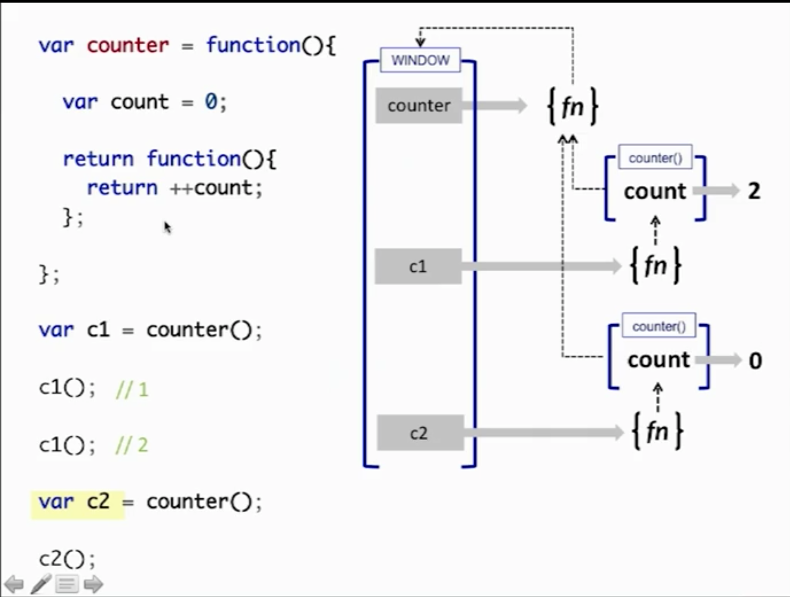
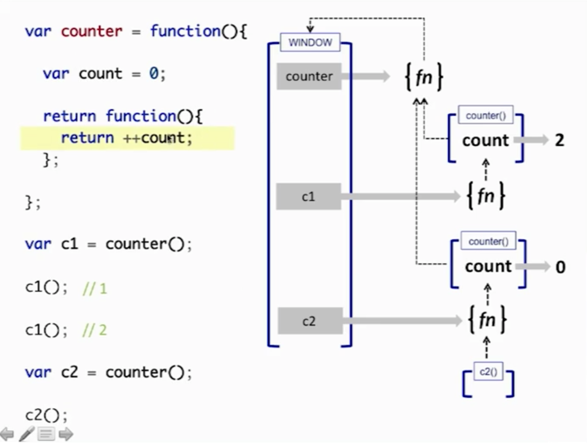

# Scope, Closures

## Scope

1. Scope: where to look for staff.
2. JS is pre-compiled language. Bash is interprited lang (when runs line 3 it doesn't know anything about line 4).
JS first go through whole code, and after that it runs it.
3. JS has functions scope (in ES5).

```js
var name = 'say';       //1

function say() {        //2
    var name = 'sing';  //3
}                       //4

function sing() {       //5
    name = 'clap';      //6
    clap = 'yay';       //7
}                       //8
```
#### Different operation: declaration and initialization;

### How much declaration inside this code - what lines?

```js
var name = 'say';        //1

function say() {         //2
    var name = 'sing';   //3

    function sing(name) {//5
        name = 'clap';   //6
        clap = 'yay';    //7
    }                    //8
    sing();
}

say();
name;
clap;
```

#### Difference RHS and LHS when asking for not declared scope var.

### Function Declaration

```js
function hello() {

}
```

### Named Function Expression

```js
var f = function sayHi(name) {
        // изнутри функции - видно (выведет код функции)
        console.log(sayHi);
    };

// снаружи - не видно (ошибка: undefined variable 'sayHi')
console.log(sayHi);
```

```js
var test = function sayHi(name) {
        sayHi = 'test'; // попытка перезаписи
        console.log(sayHi); // function...
    };

test();
```

### Exercise 1
What will be returned?

```js
function say() { return 1; }

console.log(say);
```

### Exercise 2
What will be returned?

```js
(function say() { return 1; });

console.log(say);
```

### IIFE (Immediatly Invoked Function Explession)

```js
var foo = 'foo';

(function(){
    var foo = 'foo2';
    console.log(foo);
})();

console.log(foo);
```

#### IIFE variations

```js
var foo = 'foo';

(function(bar){
    var foo = bar;
    console.log(foo);
})(bar);

console.log(foo);
```

```js
(function(bar){
    var foo = bar;
    console.log(foo);
}());
```

Send global vars inside IIFE. (window, JQery)

### Block scope of `catch`

```js
var foo;
try {
    foo.length;
}
catch(err) {
    var bar = 'yay';
    console.log(err);
}

console.log(bar);
console.log(err);
```

```js
var a = 1;
console.log(a);
try {
    a = 2;
    console.log(a);
}
catch(err) {
    console.log(a);
    a = 3;
    console.log(a);
    console.log(err);
}

console.log(a);
console.log(err);
```

### Block scope `let`, `const` (ES6)

```js
for (let i = 0; i < 10; i++) {
    console.log(i);
}
```

```js
if (bar) {
    let baz = 'bar';

    if (baz) {
        let bam = 'bam';
    }
    console.log(bam); // Error
}

console.log(baz); // Error
```

### Hoisting

**Hoisting 1.1**

```js
a;
b;
var a = b;
var b = 2;
b;
a;
```

**Hoisting 1.2** How it "looks like" after compile:

```js
var a;
var b;
a;
b;
a = b;
b = 2;
b;
a;
```

**Hoisting 2.1**

```js
var a = b();
var c = d();
a;
c;

function b() {
    return c;
}

var d = function() {
    return b();
}
```

**Hoisting 2.2** How it "looks like" after compile:

```js
function b() {
    return c;
}
var a;
var c;
var d;

a = b();
c = d();
a;
c;
d = function() {
    return b();
}
```

**Hoisting 3.1**

Proof of hoisting functions higher than vars:

```js
foo();

var foo = 2;

function foo() {
    console.log('bar');
}

function foo() {
    console.log('foo');
}
```

### Exercise

See `exercises/ex1/REARDME.md`


## Recursion

##### Exercise
Write function `sumTo(n)` which return sum all the natural numbers from 1 to `n`.

```
sumTo(3) = 3 + 2 + 1 = 6
sumTo(4) = 4 + 3 + 2 + 1 = 10
```

**Solution**

```js
function sumTo(n) {
    if (n == 1) return 1;
    return n + sumTo(n - 1);
}
```

**Mutual recursion** can't be in language without hoisting. You want to call `A`, `A` want to call `B` that is not declared yet.

```js
a(1);

function a(foo) {
    if (foo > 20) return foo;
    return b(foo + 2);
}

function b(foo) {
    return c(foo) + 1;
}

function c(foo) {
    return a(foo * 2);
}
```

#### Closure

```js
function makeAdder(num) {
    var inc = num;
    var sum = 0;
    return function() {
        sum = sum + inc;
        return sum;
    }
}
var adder3 = makeAdder(3);
console.log(adder3());
console.log(adder3());
console.log(adder3());
```

Show closure `console.dir(adder3)`.





#### Closure Exercise

```js
for (var i = 0; i < 10; i++) {

  setTimeout( function() {

    console.log(i);

  }, i * 1000);

}
```

[Link to Codepen](http://codepen.io/puzankov/pen/VjbKmz)

#### Module pattern

```js
var message = 'Hello';

function showMessage() {
    console.log( message );
}

showMessage();
```

```js
(function() {

    var message = 'Hello';

    function showMessage() {
        console.log( message );
    }

    showMessage();

})();
```
**Export to global scope**

```js
(function(window) {

    var message = 'Hello';

    function showMessage() {
        console.log( message );
    }

    showMessage();

    window.show = showMessage;
})(window);
```

**Module**

```js
var foo = (function() {

    var o = { bar: 'bar' };

    return {
        bar: function() {
            console.log(o.bar);
        }
    };
})();
```

**require**

##### Exercise

See `exercises/ex2/REARDME.md`

#### this

Every function, while executing, has a reference to its current execution context, called `this`.

```js
function shout() {
    console.log(this.name);
}

var name = 'bar1';

shout(); // bar1

var obj1 = { name: 'bar2', say: shout };
var obj2 = { name: 'bar3', say: shout };

obj1.say(); // bar2
obj2.say(); // bar3
```

Default binding
  * Strict mode — `undefined`
  * Not strict mode — global object

### Links

[Closures (en)](https://developer.mozilla.org/en-US/docs/Web/JavaScript/Closures)
[Closures (ru)](https://developer.mozilla.org/ru/docs/Web/JavaScript/Closures)
