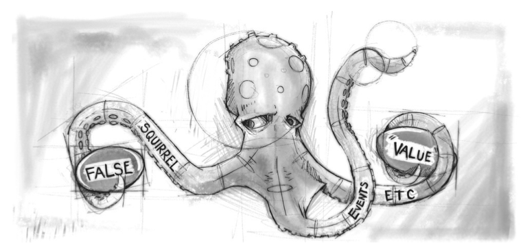

## Objects

#### Objects literals, methods, attrs
#### Using constructor functions to create functions
* Constructor
* `new Cat()`
* `this`
* What `new` doing. Empty obj, return obj. Try to remove `new`.
    
```js
    function Cat() {
        this.name = 'Murzik';
        this.color = 'white';
    }
    
    var cat = new Cat();
    
    console.log(cat);
```

```js
    function Cat(name, color) {
        this.name = name;
        this.color = color;
    }
    
    var cat = new Cat('Murzik', 'White');
    
    console.log(cat);
```

#### Object reference

```js
var user = { name: 'Sergey' };
var editor = user;

editor.name = 'Alex'; 

console.log(user.name); // 'Alex'

```




#### Singleton

```js
function Cat(name, color) {
  
    if (Cat.instance) return Cat.instance;
       
    this.name = name;
    this.color = color;  
    this.sayMeow = function() { 
        console.log('Meow. I\'am ' + this.name );
    }
    
    Cat.instance = this;
}

var cat = new Cat('Murzik', 'White');
var cat1 = new Cat('Pursik', 'Black');

console.log(cat);
console.log(cat1);

cat.sayMeow();

console.dir(Cat);
```

#### Object.keys()

```js
var user = {
    
        name: 'Sergey',

        age: 30

    };


var keys = Object.keys(user);


console.log( keys ); // name, age


```

#### Object.defineProperty()
```js
Object.defineProperty(obj, prop, descriptor);
```
[MDN](https://developer.mozilla.org/en-US/docs/Web/JavaScript/Reference/Global_Objects/Object/defineProperty)

**Descriptor params**
```
value – значение свойства, по умолчанию undefined
writable – значение свойства можно менять, если true. По умолчанию false.
configurable – если true, то свойство можно удалять, а также менять его в дальнейшем при помощи новых вызовов defineProperty. По умолчанию false.
enumerable – если true, то свойство просматривается в цикле for..in и методе Object.keys(). По умолчанию false.
get – функция, которая возвращает значение свойства. По умолчанию undefined.
set – функция, которая записывает значение свойства. По умолчанию undefined.
```

```js
var user = {};

// 1. простое присваивание
user.name = "Вася";

// 2. указание значения через дескриптор
Object.defineProperty(user, "name", { value: "Вася", configurable: true, writable: true, enumerable: true });
```


