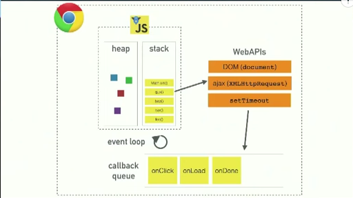
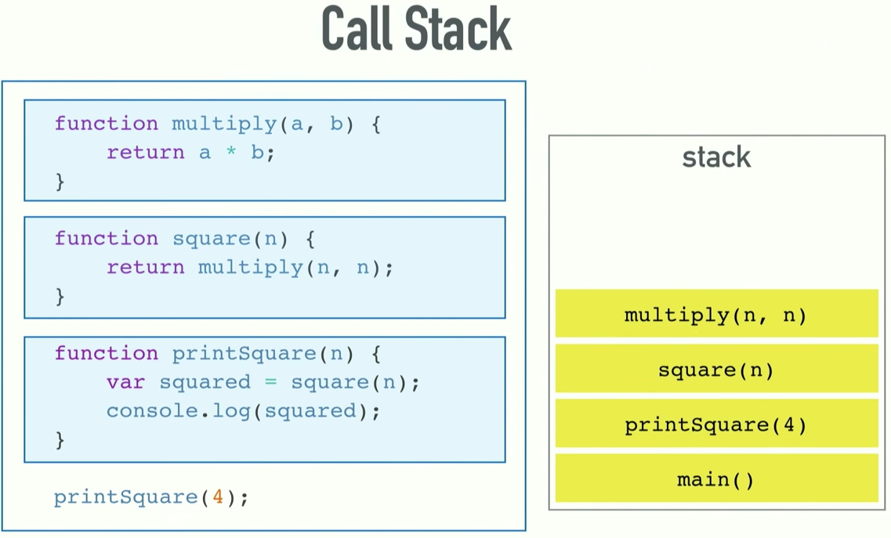
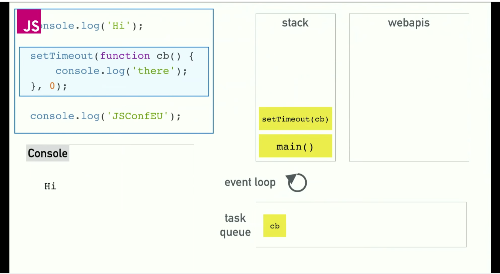

## Event loop

#### How does it works



#### Call stack



#### Task queue



* [Example 1](http://latentflip.com/loupe/?code=Y29uc29sZS5sb2coIlN0YXJ0ZWQhIik7CgokLm9uKCdidXR0b24nLCAnY2xpY2snLCBmdW5jdGlvbiBvbkNsaWNrKCkgewogICAgY29uc29sZS5sb2coJ1lvdSBjbGlja2VkIHRoZSBidXR0b24hJyk7ICAgIAp9KTsKCmNvbnNvbGUubG9nKCJIaSEiKTsKCnNldFRpbWVvdXQoZnVuY3Rpb24gdGltZW91dCgpIHsKICAgIGNvbnNvbGUubG9nKCJUaW1lb3V0IGZpbmlzaGVkISIpOwp9LCA1MDAwKTsKCmNvbnNvbGUubG9nKCJEb25lLiIpOw%3D%3D!!!PGJ1dHRvbj5DbGljayBtZSE8L2J1dHRvbj4%3D)
* [Example 2](http://latentflip.com/loupe/?code=c2V0VGltZW91dChmdW5jdGlvbiB0aW1lb3V0MSgpIHsKICAgIGNvbnNvbGUubG9nKCJUaW1lb3V0IDEiKTsKfSwgMTAwMCk7CgpzZXRUaW1lb3V0KGZ1bmN0aW9uIHRpbWVvdXQyKCkgewogICAgY29uc29sZS5sb2coIlRpbWVvdXQgMiIpOwp9LCAxMDAwKTsKCnNldFRpbWVvdXQoZnVuY3Rpb24gdGltZW91dDMoKSB7CiAgICBjb25zb2xlLmxvZygiVGltZW91dCAzIik7Cn0sIDEwMDApOwoKc2V0VGltZW91dChmdW5jdGlvbiB0aW1lb3V0NCgpIHsKICAgIGNvbnNvbGUubG9nKCJUaW1lb3V0IDQiKTsKfSwgMTAwMCk7!!!PGJ1dHRvbj5DbGljayBtZSE8L2J1dHRvbj4%3D)


**[Practice](http://latentflip.com/loupe/)**


```js
for(var i = 0; i < 10; i++) {
    setTimeout(function timer(){
        console.log(i);
    }, 0);
}

console.log("Welcome to loupe.");

```
