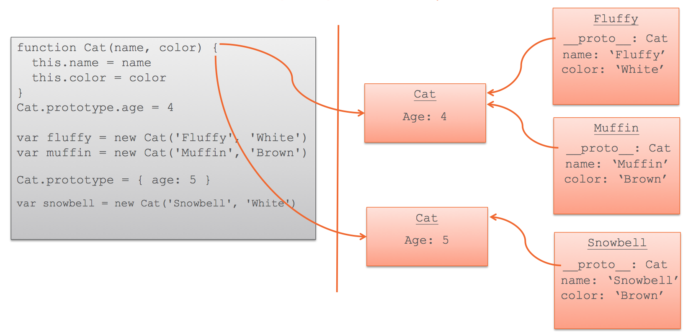

## JS Prototypes and Inheritance

```js
function Cat(name, color) {
    this.name = name; 
    this.color = color; 
}

var murzik = new Cat('Murzik', 'White');

Cat.prototype.age = 3;

console.log(Cat.prototype);
console.log(murzik.__proto__);

var pursik = new Cat('Pursik', 'Black');

console.log(pursik.__proto__);
```


```js
function Cat(name, color) {
    this.name = name; 
    this.color = color; 
}

var murzik = new Cat('Murzik', 'White');
var pursik = new Cat('Pursik', 'Black');

Cat.prototype.age = 3;

murzik.age = 2;

console.log(murzik.__proto__);
console.log(pursik.__proto__);
```



#### Object.create(null)

#### hasOwnProperty

```js
var animal = {
    eats: true
};

var rabbit = {
    jumps: true,
    __proto__: animal
};

console.log( rabbit.hasOwnProperty('jumps') ); // true: jumps принадлежит rabbit

console.log( rabbit.hasOwnProperty('eats') ); // false: eats не принадлежит
```

[Exercise 1](http://learn.javascript.ru/new-prototype#прототип-после-создания)


### Functional OOP
```js
function Machine() {
    var enabled = false;
    
    this.enable = function() {
        enabled = true;
    };
    
    this.disable = function() {
        enabled = false;
    };
}

function CoffeeMachine(power) {
    Machine.call(this); // отнаследовать
    
    var waterAmount = 0;
    
    this.setWaterAmount = function(amount) {
        waterAmount = amount;
    };
}

var coffeeMachine = new CoffeeMachine(10000);

coffeeMachine.enable();
coffeeMachine.setWaterAmount(100);
coffeeMachine.disable();
```

### Classes

```js
// конструктор
function Animal(name) {
  this.name = name;
  this.speed = 0;
}

// методы в прототипе
Animal.prototype.run = function(speed) {
  this.speed += speed;
  alert( this.name + ' бежит, скорость ' + this.speed );
};

Animal.prototype.stop = function() {
  this.speed = 0;
  alert( this.name + ' стоит' );
};

var animal = new Animal('Зверь');

alert( animal.speed ); // 0, свойство взято из прототипа
animal.run(5); // Зверь бежит, скорость 5
animal.run(5); // Зверь бежит, скорость 10
animal.stop(); // Зверь стоит
```

#### Pros and cons proto via functional
